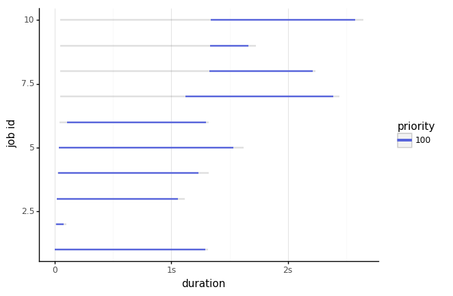
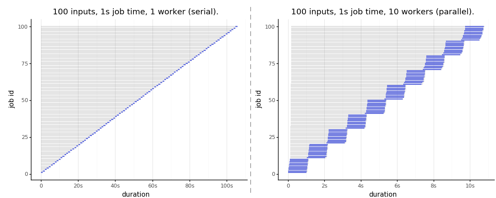
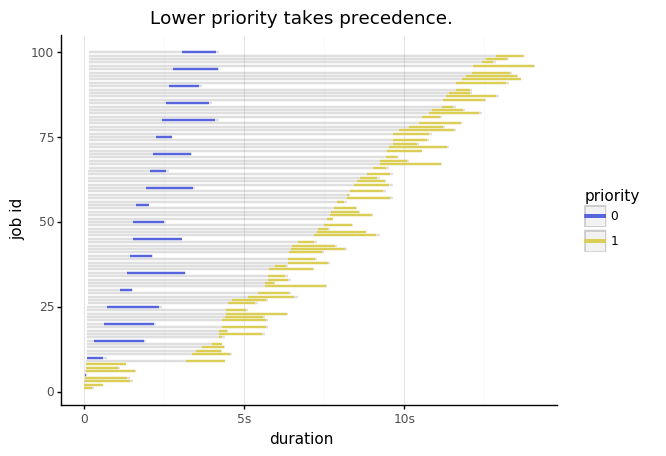

# `ezpq`: an easy parallel queueing system.

* [`ezpq`: an easy parallel queueing system.](#ezpq-an-easy-parallel-queueing-system)
  * [Background](#background)
  * [Overview](#overview)
  * [Features](#features)
  * [How to get it](#how-to-get-it)
  * [Quickstart](#quickstart)
  * [`ezpq.Queue`](#ezpqqueue)
    * [`put`](#put)
    * [`size`](#size)
    * [`wait`](#wait)
    * [`get`](#get)
    * [`collect`](#collect)
    * [`dispose`](#dispose)
    * [Decorator](#decorator)
  * [`ezpq.Plot`](#ezpqplot)
  * [Notebook of Examples](#notebook-of-examples)

## Background

I often rely on concurrent processing to perform many independent, long-running jobs quickly. Each time, I find myself wiring up functions to iterate over input, handle output, errors, time jobs, and all that's involved in practical parallel processing. I explored other options, but have yet to encounter something simple, versatile, and feature rich. With this project, I sought to create a Python package to encapsulate the logic required in efficiently managing a parallel queue. The result is a simple, customizable wrapper around both `threading.Thread` and `multriprocessing.Process` that provides all of the essential functions of an efficient parallel queueing system, and then some.

## Overview

`ezpq` implements a parallel queueing system consisting of:

1. a priority "waiting" queue in.
2. a lookup table of "working" jobs.
3. a priority "completed" queue out.


Note that this is not a traditonal first-in/first-out (FIFO) queue. Given the parallel nature, this queueing system is first-in/first-*completed*-out. In addition, the priority of an individual job can be adjusted to ensure it gets processed and retrieved before other lesser-priority jobs.

## Features

* Simple interface; pure Python.
* No required dependencies outside of standard library.
* Compatible with Python 2 & 3.
* Cross platform with MacOS, Linux, and Windows.
* Data remains in-memory.
* Priority Queueing, both in and out.
* Easily switch from processes to threads.
* Automatic handling of output.
* Rich job details, easily viewed as pandas dataframe.
* Built-in logging to CSV.
* Insightful visualizations of queue operations.

## How to get it

Install from [PyPI](https://pypi.org/project/ezpq/) with:

```python
pip install ezpq
```

To use the optional plotting features, install `pandas` and `plotnine`, or run...


```python
pip install ezpq[plot]
```

## Quickstart

Suppose you wanted to speed up the following code, which has 10 inputs that each take exactly 1 second to run, and stores the output...

```python
import random

def random_sleep(x, min=0, max=1):
    n = random.randint(min*1000, max*1000) / 1000
    time.sleep(n)
    return 'Job {} slept {} seconds.'.format(item, round(n, 2))

output = [random_sleep(x, 0, 2) for x in range(10)]

output
```

The above function should take ~10 seconds to execute; here is the output:

```python
> Runtime: 11.526

['Job 0 slept 1.29 seconds.',
 'Job 1 slept 1.04 seconds.',
 'Job 2 slept 1.31 seconds.',
 'Job 3 slept 1.79 seconds.',
 ...
```

Here is the same function, decorated with ` @ezpq.Queue() `, which will run the function 10 times in parallel with 5 workers:

```python
import ezpq

@ezpq.Queue(n_workers=5)
def random_sleep(x, min=0, max=1):
    n = random.randint(min*1000, max*1000) / 1000
    time.sleep(n)
    return 'Job {} slept {} seconds.'.format(x, round(n, 2))

output = random_sleep(iterable=range(10), min=0, max=2)

output
```

The concurrency of 5 workers reduced the runtime by more than 2/3rds. In addition, the output provides rich details about each job.

```python
> Runtime: 2.78

[{'id': 1,
  'name': 1,
  'priority': 100,
  'timeout': 0,
  'function': '<function random_sleep at 0x11bfd7d90>',
  'args': [0],
  'kwargs': {'min': 0, 'max': 2},
  'submitted': datetime.datetime(2018, 12, 11, 1, 39, 36, 681870),
  'started': datetime.datetime(2018, 12, 11, 1, 39, 36, 684734),
  'ended': datetime.datetime(2018, 12, 11, 1, 39, 36, 930090),
  'processed': datetime.datetime(2018, 12, 11, 1, 39, 36, 995742),
  'exitcode': 0,
  'cancelled': False,
  'runtime': 0.24535608291625977,
  'output': 'Job 0 slept 0.24 seconds.',
  'callback': None},
 {'id': 2,
  'name': 2,
  'priority': 100,
  'timeout': 0,
  'function': '<function random_sleep at 0x11bfd7d90>',
  'args': [1],
  'kwargs': {'min': 0, 'max': 2},
  'submitted': datetime.datetime(2018, 12, 11, 1, 39, 36, 689686),
  'started': datetime.datetime(2018, 12, 11, 1, 39, 36, 692901),
  'ended': datetime.datetime(2018, 12, 11, 1, 39, 37, 210175),
  'processed': datetime.datetime(2018, 12, 11, 1, 39, 37, 308434),
  'exitcode': 0,
  'cancelled': False,
  'runtime': 0.5172739028930664,
  'output': 'Job 1 slept 0.51 seconds.',
  'callback': None},
  ...
```

The resulting list above can easily be viewed as a pandas dataframe:

```python
df = pd.DataFrame(output)

df[['name', 'output', 'runtime']].head()
```

name|output|runtime
---|---|---
1|Job 0 slept 0.24 seconds.|0.24535608291625977
2|Job 1 slept 0.51 seconds.|0.5172739028930664
3|Job 2 slept 0.72 seconds.|0.7306220531463623
4|Job 3 slept 0.79 seconds.|0.8023269176483154
5|Job 4 slept 0.29 seconds.|0.3013160228729248

The class `ezpq.Plot` uses data returned from an `ezpq.Queue` to produce a Gannt chart of the job runtimes. This feature introduces the only non-standard dependencies; you will need `pandas` for the data reshaping and `plotnine` for the visualizations.

```python
import ezpq.Plot

plt = ezpq.Plot(output).build()
plt.save('docs/imgs/quickplot.png')
plt
```



There is a context manager interface available as well, which can allow for more versatility over the decorator approach:

```python
with ezpq.Queue(n_workers=5) as Q:
    for i in range(10):
        Q.put(random_sleep, args=[0, 2])
    Q.wait()
    output = Q.collect()
```

## `ezpq.Queue`

The `Queue` class implements the queueing system, which is itself a 3-part system composed of the:

1. waiting queue
2. working table
3. completed queue

The queueing system can be instantiated with the following parameters:

```python
Q = ezpq.Queue(job_runner=Process, # either a Process (default) or Thread function.
               n_workers=3,        # the max number of concurrent workers (processes/threads).
               max_size=0,         # the max combined size all items in the queue (0=unlimited).
               auto_remove=False,  # Should completed jobs (and their output) be kept, or discarded?
               auto_start=True,    # Should the queue start processing jobs upon instantiation?
               auto_stop=False,    # Should the queue stop after all submitted jobs are processed?
               callback=None,      # optional (synchronous) function to run after job completion.
               log_file=None,      # optional path of a CSV file used to output logs.
               poll=0.1)           # repetition period, in seconds, for the Queue operations.
```

### `put`

The `put()` method puts a job into the Queue. `put()` accepts a function and optional arguments:

```python
Q.put(function,     # the function to call
      args=None,    # positional arguments, as a list or tuple.
      kwargs=None,  # kwargs, as a dict.
      name=None,    # optional name. If blank, name is id.
      priority=100, # optional priority (default=100). Lesser values are higher priority.
      timeout=0)    # optional timeout, in seconds (0=unlimited).
```

The only required parameter is `function`. The parameters `args` and `kwargs`

### `size`

`size()` will return a count of all items across all three queue components. It accepts three boolean parameters, `waiting`, `working`, and `completed`. If all of these are `False` (default), all jobs are counted. If any combination of these is `True`, only the corresponding queue(s) will be counted. For example, I define this function to print the sizes of the entire Queue system, and each queue component:

```python
def print_sizes(Q):
    msg = 'Total: {0}; Waiting: {1}; Working: {2}; Completed: {3}'.format(
        Q.size(),
        Q.size(waiting=True),
        Q.size(working=True),
        Q.size(completed=True)
    )
    print(msg)
```

Instantiate `ezpq.Queue` and call the above function to watch the sizes change:

```python
with ezpq.Queue() as Q:
    # enqueue jobs
    for x in range(10):
        Q.put(random_sleep, args=[x, 0, 2])

    # repeatedly print sizes until complete.
    while Q.size(waiting=True, working=True) > 0:
        print_sizes(Q)
        Q.wait(n=1)

    print_sizes(Q)
```

```python
Total: 10; Waiting: 7; Working: 3; Completed: 0
Total: 10; Waiting: 6; Working: 3; Completed: 1
Total: 10; Waiting: 5; Working: 3; Completed: 2
Total: 10; Waiting: 4; Working: 3; Completed: 3
Total: 10; Waiting: 3; Working: 3; Completed: 4
Total: 10; Waiting: 2; Working: 3; Completed: 5
Total: 10; Waiting: 1; Working: 3; Completed: 6
Total: 10; Waiting: 0; Working: 3; Completed: 7
Total: 10; Waiting: 0; Working: 2; Completed: 8
Total: 10; Waiting: 0; Working: 1; Completed: 9
Total: 10; Waiting: 0; Working: 0; Completed: 10
```

### `wait`

The `wait()` method will block execution until some jobs complete. It accepts a parameter `n`, which specifies how many jobs to wait for. When this value is 0 (default) or less, `wait()` will wait for all submitted jobs to complete. It also accepts a `timeout` parameter which will break out of the call to `wait()` when exceeded. The return value is the number of jobs that did not complete within the timeout. This value should be 0; anything greater indicates the timeout as reached. The parameter `poll` can be used to adjust how frequently (in seconds) the operation checks for completed jobs (default=0.1).

```python
with ezpq.Queue() as Q:
    # enqueue jobs
    for x in range(10):
        Q.put(random_sleep, args=[x, 0, 2])

    # repeatedly wait 1 second for jobs to finish until n_remaining == 0.
    n_remaining = Q.wait(timeout=1)
    while n_remaining > 0:
        print('Timeout reached; {0} jobs remain.'.format(n_remaining))
        n_remaining = Q.wait(timeout=1)

    print('{0} jobs remain.'.format(n_remaining))
```

```python
Timeout reached; 7 jobs remain.
Timeout reached; 5 jobs remain.
Timeout reached; 3 jobs remain.
Timeout reached; 1 jobs remain.
0 jobs remain.
```


### `get`

`get()` will retrieve and delete ("pop") the highest priority job from the completed queue, if one is available. If the completed queue is empty, `get()` will return `None`. However, like `wait()`, `get()` has parameters for `poll` and `timeout`. If the timeout is exceeded, `None` is returned.

```python
with ezpq.Queue() as Q:
    # enqueue jobs
    for x in range(10):
        Q.put(random_sleep, args=[x, 0, 2])

    # repeatedly `get()` jobs until Q.size() == 0.
    output = list()

    while Q.size() > 0:
        job = Q.get(timeout=0.5)
        if job is None:
            print('Timeout reached; no output available; {0} jobs remain.'.format(Q.size()))
        else:
            output.append(job)

    print('{0} jobs remain in queue.'.format(Q.size()))
    print('Output list size: {0}'.format(len(output)))
```

```python
Timeout reached; no output available; 10 jobs remain.
Timeout reached; no output available; 7 jobs remain.
Timeout reached; no output available; 5 jobs remain.
Timeout reached; no output available; 2 jobs remain.
0 jobs remain in queue.
Output list size: 10
```

### `collect`

`collect()` is similar to `get()`, but it will return a list of *all* completed jobs and clear the completed queue. It does not support the `poll` or `timeout` parameters, but you can call `wait()` before `collect()` if necessary.

```python
with ezpq.Queue(n_workers=5) as Q:
  # enqueue jobs
    for x in range(10):
        Q.put(random_sleep, args=[x, 0, 2])

    # wait and collect all jobs
    print('Queue size before: {0}'.format(Q.size()))

    Q.wait()
    output = Q.collect()

    print('Queue size after: {0}'.format(Q.size()))
    print('Output size: {0}'.format(len(output)))
```

```python
Queue size before: 10
Queue size after: 0
Output size: 10
```

### `dispose`

The queueing operations performed by `ezpq.Queue` are performed on a periodic basis. By default, the `poll` parameter for a Queue is `0.1`, or 100 ms., or ten times a second. This "pulse" will continue until the Queue is disposed of.

In the previous examples, we have not concerned ourselves with disposing of the `ezpq.Queue`, as it is done automatically with the context manager (`with ezpq.Queue() as Q...`). However, if you choose not to use the context manager or decorator interfaces, you must clean up after yourself.

```python
logger.setLevel(log.DEBUG)

Q = ezpq.Queue() # by default, n_workers = # of cpu cores (mp.cpu_count()).

# enqueue jobs
for x in range(10):
    Q.put(random_sleep, args=[x, 0, 2])

# wait and dispose
Q.wait()
Q.dispose()
```

The example above also enables debugging logs, which produces:

```python
DEBUG: Initialized queue with 8 workers.
DEBUG: Initialized pulse.
DEBUG: Started job '1'
DEBUG: Started job '2'
DEBUG: Started job '3'
DEBUG: Queued job: '4'
DEBUG: Queued job: '5'
DEBUG: Queued job: '6'
DEBUG: Queued job: '7'
DEBUG: Queued job: '8'
DEBUG: Queued job: '9'
DEBUG: Queued job: '10'
DEBUG: Completed job: '1'
DEBUG: Started job '4'
...
DEBUG: Completed job: '8'
DEBUG: Completed job: '9'
DEBUG: Completed job: '10'
DEBUG: Removed jobs.
DEBUG: Removed output.
DEBUG: Removed completed.
DEBUG: Reset counters.
DEBUG: Stopped pulse.
```

### Decorator

Now that you have a understanding of the basic operations, recall the first example which makes use of the `ezpq.Queue()` as a decorator.

```python
@ezpq.Queue(n_workers=5)
def random_sleep(x, min=0, max=1):
    n = random.randint(min*1000, max*1000) / 1000
    time.sleep(n)
    return 'Job {} slept {} seconds.'.format(x, round(n, 2))

output = random_sleep(items=range(10), min=0, max=2)
```

By using the decorator, each call to `random_sleep(items=[...], ...)` is actually running this:

```python
for x in items:
    Q.put(function=fun, args=[x]+list(args), kwargs=kwargs)
Q.wait()
job_data = Q.collect()
Q.dispose()
return job_data
```

Some notes on using the decorator interface:

1. The decorated function (in this case, `random_sleep`), must accept at least one parameter that will be used to store the next item from an iterable (in this case, `x`).
2. When calling the function, you must specify the list of items to iterate over as the first argument (or as a named arg with `items=[...]`).

## `ezpq.Plot`

The `Plot` class is used to visualize the wait, start, and end times for each job that entered the queueing system. The class accepts a list of the job_data; exactly what is returned from a call to `collect()`. It also allows for a `title` and `color_by` parameter. `color_by` accepts any of 'priority', 'cancelled', 'exitcode', 'name', or 'output', and will color code the bar accordingly.

Below, the left plot is a serial, one-by-one operation; the right plot uses an `ezpq.Queue` queueing system with 10 workers.

```python
plt = ezpq.Plot(output).build()
#plt.save('...')
plt
```



Each horizontal bar represents an independent job id. The start of the gray bar indicates when the job entered the queuing system. The start of the colored bar indicates when the job started running, and when it ended. The gray bar that follows (if any) reflects how long it took for the queue operations to recognize the finished job, join the job data with its output, remove it from the working table, and place it in the completed queue.

Let's implement a queueing system that takes advantage of the `priority` feature, then visualize the results. Here, numbers that are divisible by 5 have the greatest priority.

```python
with ezpq.Queue() as Q:
    # enqueue with priority
    for x in range(100):
        Q.put(random_sleep, args=[x, 0, 2],
            priority=int((x+1) % 5 != 0)) # 0 is higher priority than 1.

    # wait and collect
    Q.wait()
    output = Q.collect()

plt = ezpq.Plot(output, color_by='priority',
                title='Lower priority value takes precedence.').build()

plt
```



## Notebook of Examples

Many more examples can be found in [docs/examples.ipynb](docs/examples.ipynb).
